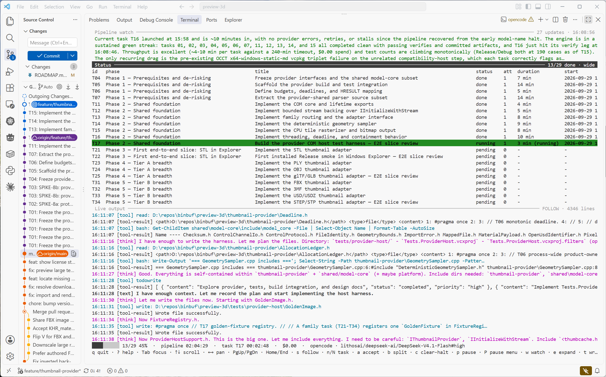

# symphony

A reasonably thin LLM task harness. Chain complex task sets together, use multiple LLM providers, escalate to frontier model or break down to smaller tickets automatically, system 1 model decision making (w/ jev), Slack notifications, interactive TUI, and much more.

<p align="center">
  
</p>

`symphony` temporarily lives in `<your target project>/.symphony/` (gitignored) and reads its plan from `<project>/docs/` and launches using your provider's LLM CLI tool.

Providers: **Claude Code · Cursor · OpenCode · Codex CLI · Gemini CLI · Google Antigravity** — all launched with permission prompts bypassed so nothing ever waits on a human (`--safe` turns that off for one run). Connectors/MCP configured inside each agent keep working: symphony only launches the CLI and reads its output. An optional [`mcp` block](#mcp-selection) can scope each session to a chosen subset of servers, so unrelated toolchains cost nothing.

**Contents** — [Why symphony](#why-symphony) · [Quick start](#quick-start) · [The lifecycle](#the-lifecycle) · [Run scenarios](#run-scenarios) · [Pivoting mid-run](#pivoting-mid-run) · [Splitting a task](#splitting-a-task) · [Automatic breakdowns](#automatic-breakdowns) · [Multiple task sets](#multiple-task-sets) · [The docs contract](#the-docs-contract) · [CLI reference](#cli-reference) · [MCP selection](#mcp-selection) · [Providers](#providers) · [Escalation](#escalation) · [Fallback](#fallback) · [Jev](#jev) · [Vision tool](#vision-tool) · [Pipeline watch](#pipeline-watch) · [Judge](#judge) · [Slack notifications](#slack-notifications) · [Config](#config) · [Hooks](#hooks) · [Logs and state](#logs-and-state) · [Platform support](#platform-support) · [Exit codes](#exit-codes) · [Developing the harness](#developing-the-harness)

## Why symphony

- **Unattended by default.** No session ever waits on a human. The harness handles the things that normally make you babysit an agent: transient API failures, oversized tasks, missing result blocks, runaway loops, and dirty worktrees.
- **Fresh context per task.** Every task starts in a brand-new session with its task file and pointers to `ROADMAP.md`, the per-task progress notes under `docs/progress/`, the design docs and the generated `docs/INDEX.md`; it reads only what the task needs. No context rot, no hidden state carried from the previous task.
- **Everything lands in git.** Each task ends in a commit that carries the code, the roadmap marker, the task's hand-off, the design updates and the run log. `git log` is the pipeline's history; `git revert` is the undo.
- **Resumable and inspectable.** Kill it, crash it, or pause it with a file — state and roadmap markers let the next run pick up exactly where it left off. Every session's exact prompt, rendered log and raw NDJSON are saved.
- **Provider-agnostic.** The same plan and lifecycle work with any of the six agent CLIs, or the built-in `fake` provider for testing the harness itself without spending anything.
- **Guardrails you control.** An independent verify command after every `done` (your `verifyCommand`, a per-task `verify:`, or the project's `npm test`), retry/halt policies, per-task and per-run cost caps, and lifecycle hooks for notifications or CI.

## Quick start

### 1. Clone into your shared repos folder, then install into your project

```bash
# macOS / Linux — clone next to your other repositories
mkdir -p ~/repos && cd ~/repos
git clone https://github.com/binbuf/symphony.git      # or git@github.com:binbuf/symphony.git
cd symphony
./install.sh /path/to/your/project
```

```powershell
# Windows (PowerShell) — clone next to your other repositories
New-Item -ItemType Directory -Force "$HOME\repos" | Out-Null
Set-Location "$HOME\repos"
git clone https://github.com/binbuf/symphony.git      # or git@github.com:binbuf/symphony.git
Set-Location symphony
./install.ps1 -Target C:\path\to\your\project
```

The installer builds symphony in the clone (`npm install && npm run build`) and copies the compiled `dist/`, the launchers, this README and the config example into `<project>/.symphony/`. It also:

- writes `<project>/.symphony/.gitignore` containing `*`, so the installed harness stays untracked;
- appends `.symphony/` to your project's `.gitignore`;
- seeds `<project>/.symphony/symphony.config.json` from the example if it does not exist.

Re-run the installer any time to upgrade: build output is replaced, your config is left alone. Requirements: **Node ≥ 20.11**, **git**, and the agent CLI you use. **OpenCode must be 1.x** — 2.x is beta and not yet supported (see [Providers](#providers)). The installed copy has no runtime dependencies.

### 2. (Optional) Pick a provider and configure it

symphony defaults to **Claude Code** (`claude`). Install and log in to the agent CLI you want first, then edit `<project>/.symphony/symphony.config.json`:

```json
{
  "provider": "opencode",
  "providers": {
    "opencode": { "model": "claude-sonnet-4-5", "modelProvider": "anthropic" }
  }
}
```

`modelProvider` is the upstream provider a model id belongs to; only OpenCode needs it (it addresses models as `provider/model`), and symphony composes `modelProvider/model` for you. Every other CLI takes the bare `model` and ignores `modelProvider`.

Or override per run: `./.symphony/symphony run --provider codex --model gpt-5`. The resolution order is `--provider/--model/--model-provider/--variant` > `SYMPHONY_PROVIDER`/`SYMPHONY_MODEL`/`SYMPHONY_MODEL_PROVIDER`/`SYMPHONY_VARIANT` > task front matter > config > defaults. Every key is optional; see [Providers](#providers) and [Config](#config). `doctor` verifies the chosen binary and its login before anything runs.

### 3. init → doctor → run

```bash
cd /path/to/your/project
./.symphony/symphony init      # scaffold docs/ (never overwrites anything)
./.symphony/symphony doctor    # preflight: node, git, roadmap, every provider a task uses + auth, verify, halt/STOP/lock
./.symphony/symphony run       # work through the roadmap, one fresh session per task
```

On Windows use `./.symphony/symphony.ps1` (or `.symphony\symphony.cmd` from `cmd.exe`). Every command accepts `--root DIR` to point at another project.

`init` creates the docs skeleton and a starting config. Then fill in the plan — one of three ways:

| you have… | do this |
|---|---|
| an idea, no plan | `./.symphony/symphony brief` prints a paste-ready prompt; give any LLM your idea plus that text and drop the files it returns into the project |
| a plan already | write `docs/ROADMAP.md` and `docs/tasks/NN-slug.md` yourself (templates are scaffolded) |
| planning docs in another shape | `./.symphony/symphony lint` shows what differs; `./.symphony/symphony prepare` lets the agent convert them in place and commits the result |

## The lifecycle

```
 install ──▶ init ──▶ doctor ──▶ run ─────────────────────────────────────────────┐
                                  │  per task, in roadmap order:                 │
                                  │    mark [~] running → spawn fresh session    │
                                  │    stream output → parse SYMPHONY_RESULT     │
                                  │    verify → log → commit → next task         │
                                  └── done ─ continue ─ blocked ─ failed ──▶ status / accept / reset / nudge
```

### Preflight — `doctor`

Run it before the first `run` and after changing providers or config. It checks, in order: Node version, that the project is a git repository (and whether the worktree is dirty), that `ROADMAP.md` exists and parses, that the binary of every provider a task will use is on `PATH` (per-task front matter included), that they are authenticated, that an independent verify command exists (warning when nothing will check a `done`), that the [`vision` tool's](#vision-tool) API key is present when it is enabled, that the [Slack](#slack-notifications) target and token are set when it is enabled, and whether a halt, STOP sentinel or another live run (lock) would block you. Failures exit `4`; warnings do not stop a run. `run` repeats these checks itself before every invocation.

### `init` — scaffold the plan

Creates the docs skeleton and config, never overwriting existing files:

```
docs/
  ROADMAP.md              the ordered task list (bullets the harness owns the checkbox of)
  PROGRESS.md             a small generated index: the "Key facts" digest plus a link to each task note
  progress/TNN.md         one note per task (what later tasks need to know), written by that session
  logs/README.md          explains the per-task run logs the harness regenerates
  tasks/TEMPLATE.md       the task-file template
  design/README.md        architecture docs the sessions read and update
  design/adr/0000-template.md
.symphony/symphony.config.json
.gitignore                adds .symphony/ and the stop sentinel
```

### `run` — the main loop

`run` walks the selected tasks in roadmap order. For each one:

1. **Marks the bullet** `[~] ⟵ running` and records the attempt in `.symphony/state.json`.
2. **Builds the prompt** and writes it to `.symphony/runs/<task>-<stamp>.prompt.md`. It contains the task file, the paths of the roadmap, the per-task progress notes, `docs/design/`, `docs/INDEX.md` and the run logs, the rules for the session, and the required result block. The session reads the files it needs with its own tools, so the prompt stays small however large those files grow. Set `maxProgressBytes`, `inlineDesignDocs` or `maxIndexBytes` to paste bodies back in when you want them.
3. **Spawns the provider CLI** in the project root with permissions bypassed, and streams what it does:

   ```
   14:08:10 [init] session=... model=...
   14:08:12 [think] I should read the existing schema before adding the table
   14:08:15 [text]  Adding the migration.
   14:08:18 [tool]  Bash: npm test
   14:08:24 [tool-result] 42 passing
   14:08:31 [result] ok ($0.42 · 12 turns · 310s)
   ```

   Every line written to stdout and to a session log carries a local `HH:MM:SS` timestamp (harness `INFO`/`WARN`/`ERROR` lines too), so a run's timing is visible at a glance. Raw NDJSON (`.jsonl`) stays byte-faithful and is not timestamped.

4. **Parses the result block** every session must end with:

   ```
   SYMPHONY_RESULT
   status: done | continue | blocked | failed
   summary: <one line>
   END_SYMPHONY_RESULT
   ```

   - `done` — acceptance criteria met and the named tests pass.
   - `continue` — a real slice landed but the task needs more. The harness commits the slice and starts a **fresh** session for the next one, up to `maxContinuations`. This is how a large task is split across manageable sessions without losing progress.
   - `blocked` — a human decision or external dependency is genuinely required.
   - `failed` — anything else.

5. **Verifies independently.** A per-task `verify:` (front matter) wins, then `verifyCommand`; when neither is set the harness uses the project's `package.json` test script (`npm test`) if one exists (`inferVerify: false` disables that). It runs the command itself after a `done`. A non-zero exit demotes the task to `failed` and records the command, exit code and output tail in the logs. Provider-agnostic: any command, any stack.
6. **Writes the record.** `docs/logs/TNN.md` (status, provider/model, timing, cost, commit, each session's reported status and summary), then regenerates the pipeline status block at the bottom of `ROADMAP.md`.
7. **Commits everything** with `git add -A && git commit -m "T01: <title> [<status>]"` (template configurable). Before staging, an ephemeral-file guard keeps secrets and build junk out of the commit by adding them to `.gitignore` — agent-created source files still land. A failed commit is retried once; if it still fails the task is demoted to `failed` rather than recorded `done`, because its work is not in git. Commits also refuse to run if a session switched branches (`HEAD` is checked against the branch the run started on).
8. **Starts the next task in a new session.** Each session is also instructed to write its own `docs/progress/TNN.md` note, fill the task file's `## Hand-off`, run the named tests in the foreground, and update the design docs/ADRs its work touched.

### Keeping task prompts small

The task body and execution rules are always included in a first task session. Completed-task status is summarized as counts; the roadmap holds the full list. The result format comes last, after any inlined context. Fresh continuation sessions read the task and its Hand-off from disk and retain the same scope, verification, Git and documentation rules.

For existing deployments, check `.symphony/symphony.config.json`: upgrades preserve that file, so old inlining settings can still produce large prompts even though current defaults are lean. Use:

```json
{
  "maxProgressBytes": 0,
  "inlineDesignDocs": false,
  "maxIndexBytes": 0
}
```

These settings leave the progress notes, design docs and generated index available for the agent to read as needed. `progressDigest` and `repoMap` can stay enabled. Inspect the exact prompt with `run --dry-run` or in the saved `.symphony/runs/*.prompt.md` files.

When you opt into inlining, `maxProgressBytes` covers the entire progress body, including the digest, recent-section headings and omission notices. Recent facts are included once; the digest summarizes older sections and uses at most half the budget, up to 8 KB. `maxIndexBytes` applies equally to saved and dry-run indexes, and `maxTaskBytes` includes its truncation notice. Block delimiters and execution rules sit outside those individual content budgets. A truncated task explicitly requires reading the full file before implementation; truncated design docs name their full paths. Because each task's notes live in its own small `progress/TNN.md`, a long task chain no longer grows any single file that a session must read.

### The run view (TUI)

When `run` starts with stdout **and** stdin attached to a terminal, it opens a full-screen view instead of scrolling output:

- **Status** (top panel) — the same table as `symphony status`, refreshed from live state: id, phase, title, status, attempts, duration, start/end, cost, provider, model, summary. A task split across sessions or retried lists its per-session rows beneath it. The task the pipeline is on is background-filled — forest green while it runs, red when it is the task a run halted on after failing; failed tasks from earlier runs are left plain. The selected row is inverted (press `n`/`N`), and a queued pause target (`P`) is yellow. The panel follows the run: it scrolls to recentre on the active task on start and whenever the pipeline moves to a new one (manual scrolling still works between changes).
- **Pipeline watch** (strip above the status table, when enabled) — a separate read-only model's latest short summary, refreshed on a timer and whenever a task ends (see [Pipeline watch](#pipeline-watch)). It reads `Waiting for updates` until the first check lands, with the countdown to that check on the right of the title.
- **Live output** (bottom panel) — exactly what `run` streams today: harness `INFO`/`WARN`/`ERROR` lines and the provider's `[think]`/`[text]`/`[tool]`/`[result]` stream, tailing by default.
- **Status bar** — pipeline progress and duration, the current task and its elapsed time, reported cost, provider/model, and any `PAUSED`/`HALTED`/`blocked` badge, with the key hints beneath. A transient task-status toast (e.g. `T02 → running`) briefly takes the metrics row; the key-hints row always stays put.

Each panel scrolls independently, vertically and horizontally, with the keyboard or a mouse: the wheel scrolls, a horizontal tilt-wheel pans, middle-button drag pans horizontally, left-click selects a task row (or focuses the panel under the pointer), and right-click toggles follow. Because the TUI captures mouse input, use **Shift+drag** for the terminal's native text selection. The view turns itself off when output is piped or in CI, with `--no-tui`, or with `"tui": false` in the config; `--tui` forces it.

Pressing `b` on a selected task is the one key that rewrites the plan: the run pauses at the next boundary (or the session running now is stopped when it is that task), one agent session breaks the task into subtasks — `T10` becomes `T10a`, `T10b`, … — and the run resumes automatically on them. A halted task can be split too: the halt is a symptom of the oversized task, and the split clears it.

| key | action |
|---|---|
| `q` / `Ctrl-C` | quit — asks for confirmation, then stops the current session (like today's Ctrl-C). In an attached view (`symphony attach`) it detaches instead, leaving the run going |
| `?` | help overlay (any key closes it) |
| `Tab` / `Shift-Tab` | move focus between the status and output panels |
| `↑ ↓` / `PgUp` / `PgDn` / `Home` / `End` / `g` / `G` | scroll the focused panel; scrolling the output up pauses tailing |
| `← →` / `h` / `l` | pan the focused panel horizontally |
| `s` | toggle follow (tail) on the focused panel |
| `n` / `N` | select the next / previous task |
| `a` | accept the selected blocked/failed task (asks for confirmation) |
| `b` | break the selected task down into subtasks (T10 → T10a, T10b, …) — stops the run, lets the agent rewrite the task, then resumes on the subtasks |
| `c` | clear a halt (asks for confirmation); after a halt the view stays open, so `c` clears it and restarts |
| `p` | pause / resume now by toggling the `.stop` sentinel (stops at the next boundary) |
| `P` | open the pause menu: `1` as soon as possible (stop the running session, close the task out, commit and pause), `2` at the next boundary, `3` before the selected task |
| `w` | run a pipeline-watch check now |
| `t` | wrap long lines in the Live output panel (off = clip and pan with `← →`) |
| `f` | filter the Live output by message type: a menu toggles `text`/`think`/`tool`/`result`/`[jev]`/`error`/`warn`/`info` (a line matches any of its tags), with `a`/`0` to show all again; the title shows the active filter and the kept/total line count |
| `F` | clear the Live output filter in one key (show every message type) |
| `z` | cycle layout: both panels · status only · output only |
| `[` `]` (or `-` `+`) | adjust the panel split |

On exit the terminal is restored and the last lines are replayed to normal scrollback, so the outcome survives in your history.

### Detached runs and attaching

The harness and its view need not live in the same process. `symphony start` launches the run detached and headless; `symphony attach` opens the same full-screen view as a client; `symphony stop` ends it.

```bash
./.symphony/symphony start              # run in the background, no terminal needed
./.symphony/symphony start --only T05   # any `run` flag is forwarded
./.symphony/symphony attach             # open the run view against the live (or finished) run
./.symphony/symphony stop               # graceful stop, then a signal if it does not answer
```

Detaching is safe: the daemon owns the same lock, heartbeat and git branch a foreground run does, writes its output to `.symphony/daemon.log`, and publishes a heartbeat in `.symphony/runtime.json` (phase, current task, live stream path, watch panel, queued pause target). `attach` polls that plus `state.json`, tails the session log the daemon names, and routes commands back through `.symphony/control/` — a directory of request/response files, so there are no ports or sockets. Pressing `q` in an attached view **detaches**, leaving the run going; use `symphony stop` to end it. `pause` (`p`), the pause menu (`P`: asap / before the selected task), `accept` (`a`), `split` (`b`), `clear-halt` (`c`) and `watch` (`w`) all work from an attached view exactly as they do in a foreground run. Attaching after the run has already finished is a read-only browse of the final state (and can still `accept` or `clear-halt`, since nothing else is writing).

The previous behaviour is unchanged: `symphony run` (or `symphony run --no-tui`) is a foreground run, and `run` with no console still refuses to start a second harness while one is live.

### Mid-run: how the harness keeps going

| event | what happens |
|---|---|
| session ends cleanly but with **no result block** | it is resumed once with a close-out prompt (a "nudge"); `--no-nudge` disables |
| **transient error** — rate limit, overloaded, 5xx, dropped socket, stalled output, crash, a dropped MCP/plugin/tool session | retried in place with exponential backoff (30 s base, doubling, capped at 15 min, jittered, a provider `Retry-After` honoured), **resuming the same session** when the provider supports it, so work is kept. A transient retry does **not** count as a task attempt, so a provider throttle can never trip the attempts halt. The same backoff retries a `verify` that dies on a transport fault (a dropped MCP/plugin session, a reset connection) rather than failing a task whose work is already done. With the [`fallback` block](#fallback) on, a task that has already spent `afterAttempts` retries on the primary is switched to the fallback provider instead of retrying it again |
| **fatal error** — auth, no credits, usage limit, unknown model, bad config, missing binary | the run **halts**: banner, exit `3`, sticky in `state.json`; later `run`s refuse to start |
| task fails **twice in a row**, or one task fails **3 times** | the run halts (thresholds configurable) |
| `continue` past `maxContinuations` | treated as failed |
| a `breakdown` stage fires (task starts too big, `continue` boundary, blocked report, failure) | one decision — Jev → fallback LLM → rules — answers split / replan / carry on / escalate / stop; a split rewrites the task into subtasks and a replan the upcoming plan, and the run continues on the result in the same invocation |
| `maxIterationsPerTask` / `maxTasksPerRun` / `--budget` reached | the task fails gracefully, or the run processes only the first N tasks, with a clear summary |
| `touch .stop` (path configurable) | pauses at the next boundary — before the next task, or after the current slice when a task is split via `continue` — exit `0`; nothing is killed, and a mid-continuation pause resumes the right slice next run. `touch .symphony/STOP` is the legacy alias. In the TUI, `p` toggles the sentinel now and `P` opens a menu to choose asap, next-boundary, or before-a-task |
| pause as soon as possible (TUI `P` then `1`; control `wrap-up`) | stops the session in flight, resumes it (or opens a fresh one when the provider cannot resume) with a close-out prompt that stops new work, updates `PROGRESS.md` and the task's Hand-off, and leaves a clean build; the harness then runs its verify command as an independent build check, commits the slice and pauses. The task stays unfinished and resumes at its next slice on the next run |
| commit fails (pre-commit hook, signing, `index.lock`) or a session switched branches | retried once; if it still fails the task is demoted to `failed` instead of recorded `done`, because its work did not land in git |
| reported session cost crosses `maxCostUsdPerRun` | halts the run before the next task; `clear-halt` to continue |
| Ctrl-C, the TUI's `q`, or closing the terminal | kills the current session, records the task unfinished, exits `130`/`143`; press twice to force quit. The interrupted attempt is given back, so a manual stop cannot exhaust `halt.maxAttemptsPerTask` or feed the failure rules — those gates exist for unattended runs. A task found left `running` by a killed process (or a crash) also has its unfinished attempt given back on the next run |
| another run already active | refuses to start, exit `4` (lock file holds the live pid and a heartbeat) |

### After the run: review and steer

| command | what it does |
|---|---|
| `status [--json]` | progress table: id, phase, title, status, attempts, duration, start/end, cost, provider, model (`model#variant`), summary. A task split across sessions or retried (attempts ≥ 2) also lists one line per session run beneath its parent line, each with its own start/end, duration, provider/model and summary — so an escalated run's model is visible at a glance |
| `accept T05 [--note "…"]` | human sign-off on a blocked/failed task; counts as done, bullet becomes `[x] ⟵ accepted` |
| `nudge T05 [--note "…"]` | resume the task's last session and ask it to close out with a result block |
| `reset T05 [--revert]` | clear a task's state so it runs again; `--revert` also `git revert`s its `T05:` commits (newest first) |
| `reset --all` | clear every task's state and the halt, and reset every roadmap marker to `[ ]`, so a replaced or rewritten roadmap starts clean |
| `replan [--direction FILE] [--allow-id-reuse] [--reset-state] [--dry-run]` | stop-and-pivot: let the agent rewrite the plan (roadmap, task files, design docs, a pivot ADR) for a new direction, reconcile state, and commit it as a docs change |
| `split T05 [--into N] [--note "…"] [--dry-run]` | break one oversized task into subtasks (`T05` → `T05a`, `T05b`, …): the agent rewrites the task file as a series of smaller ones and replaces its bullet, the harness validates the result, reconciles state and commits; see [Splitting a task](#splitting-a-task) |
| `clear-halt` | lift a halt so `run` can start again. For an `attempts` halt, add `--retry` (`run --clear-halt --retry --only T05`) or `reset T05`: clearing the halt alone leaves the task's failure counter at the limit, so the next run re-halts |

`status` shows `running?` for a task whose recorded process is gone (harness crashed); the next `run` retries it. A human ticking `[x]` in `ROADMAP.md` is honoured by the next command that loads the project.

## Run scenarios

Everything that can happen to a task, and what you do about it.

| # | scenario | what the harness does | roadmap / state | exit | what you do |
|---|---|---|---|---|---|
| 1 | task reports `done`, verify passes | commits the task; starts the next task in a new session | `[x]` | – | nothing |
| 2 | task reports `continue` | commits the slice; starts a fresh session for the next slice (≤ `maxContinuations`) | `[~] ⟵ running` between sessions | – | nothing |
| 3 | `continue` past the limit | marks the task failed | `[~] ⟵ failed` | 2 | `symphony split T05` to break it down, or raise `maxContinuations` |
| 4 | task reports `blocked` | stops for a human (default); `onBlocked: "continue"` moves on instead; with `breakdown.onBlocked` a breakdown decision may first split off the automatable parts or rewrite the plan to add a prerequisite the block names | `[~] ⟵ blocked` | 2 | read the task's Hand-off; `accept T05 --note "…"` or `run --retry --only T05` |
| 5 | task reports `failed` | a summary naming a transient infra fault (dropped MCP/plugin session, reset connection, 5xx) is retried with backoff; otherwise stops | `[~] ⟵ failed` | 2 | fix the cause, then `run` (failed tasks are retried) |
| 6 | `done` but verify fails | a transport fault (dropped MCP/plugin session, reset connection) is retried with backoff; a real failure demotes to failed and records command, exit code and output tail | `[~] ⟵ failed` | 2 | fix, then `run` |
| 7 | session ends without a result block | resumes it once to close out | `[~] ⟵ running` while nudging | – | nothing (or `--no-nudge` and accept that it fails) |
| 8 | transient error | retries with backoff, resuming the session; the attempt is not counted | `[~] ⟵ failed` while retrying | – | nothing |
| 9 | fatal error (auth, billing, usage limit, model, config) | halts the whole run; sticky until cleared | halt banner in `status` | 3 | fix the cause, `clear-halt`, `run` |
| 10 | 2 failures in a row / 3 attempts on one task | halts | halt banner in `status` | 3 | fix, `run --clear-halt --retry --only T05` |
| 11 | `.stop` sentinel present | pauses at the next boundary (before a task, or after a `continue` slice); a mid-continuation pause is remembered and resumes the next slice | – | 0 | `rm .stop`, `run` |
| 12 | Ctrl-C / TUI `q` / terminal closed | kills the current session; task recorded unfinished (failed), without consuming an attempt or counting toward the failure rules | `[~] ⟵ failed` | 130/143 | `run` retries it |
| 13 | second run while one is active | refuses to start | lock file with live pid | 4 | wait, or delete `.symphony/lock` if stale |
| 14 | `maxIterationsPerTask` / `maxTasksPerRun` / budget hit | task fails gracefully, or the run processes only the first N tasks | task `failed` / rest `pending` | – | raise the limit, or `symphony split` the task |
| 15 | you tick `[x]` by hand | next load reconciles state to the roadmap tick | `[x]` | – | nothing |
| 16 | `reset T05 --revert` | clears state and reverts the task's commits newest-first; on conflict it stops and tells you to resolve | `[ ]` pending | 0 | fix conflicts if any, then `run` |
| 17 | `breakdown.enabled` and a task looks too big or the plan around it wrong (at its start, after a `continue` slice, when it reports blocked, or where it would escalate/fail) | one decision (Jev → fallback LLM → rules) answers split / replan / carry on / escalate / stop; a split runs the split session and a replan rewrites the upcoming plan; the run commits and continues on the result | `T10` → `T10a`, `T10b` (parent state pruned), or a rewritten roadmap with only never-run tasks reshaped | – | nothing; `breakdown.decision: "rules"` keeps it offline and free |

The pipeline stops for a human only when a task itself reports `blocked`, or a fatal provider/config problem halts the run. Everything else — transient errors, large tasks, missing result blocks — is handled by retry, continuation and nudge.

## Pivoting mid-run

Sometimes you discover half-way through that the design is wrong. symphony does not re-plan a running task; it pauses at a task boundary, re-plans the docs, commits the pivot, and resumes with fresh context.

1. **Pause cleanly.** `touch .stop` — the current slice finishes and commits, then `run` exits `0` before the next task or the next continuation session. A task split via `continue` remembers which slice it reached and resumes there. In the TUI, press `P` and choose `3` to pause before the selected task: the harness places the sentinel only when the run reaches it, so you pause exactly at that task rather than at the next boundary. (`P` then `1` is the faster option when you want to stop now: it closes the running task out and commits it first.) (Ctrl-C mid-task also works but records that task `failed`; prefer the sentinel.)
2. **Write the new direction.** Put it in `docs/REPLAN.md` (or pass `--direction FILE`): what changed, what still stands, what to drop. This is the one input the harness does not own, so keep it outside the docs contract.
3. **Let the agent re-plan.** `symphony replan` hands the direction, the current roadmap, `PROGRESS.md`, the design docs and the live code state to one session, which rewrites `ROADMAP.md`, the task files and the design docs and records the pivot as a superseding ADR. It re-lints and commits the result as `docs: replan … [replan]`, so the pivot is a normal commit you can review or `git revert`.
4. **Reconcile state.** `replan` prunes state rows for tasks that no longer exist, and refuses to reuse an id that already ran for different work unless you pass `--allow-id-reuse`. `--reset-state` clears all state instead; `reset --all` does the same on its own.
5. **Resume.** Remove the sentinel (`rm .stop`) and `symphony run`.

Why not re-plan inside a running session? The one-fresh-session-per-task model is the whole point: a session gets its task and nothing else, and a task that changes underneath it is exactly the context rot symphony exists to avoid. Pause, re-plan, commit, resume — the pivot stays auditable in `git log`.

The same move can happen automatically when the harness notices the problem itself: an [automatic breakdown](#automatic-breakdowns) verdict of *replan* runs this scoped-down shape of the same machinery — rewrite only the tasks that have not run, validate that finished work is untouched, commit, reload and resume — without stopping for you first.

## Splitting a task

A task that keeps reporting `continue`, fails its verify, or halts the run on repeated attempts is usually too big for one session. `symphony split` replaces it with a short series that runs in its place:

```bash
./.symphony/symphony split T05                 # let the agent decide how many subtasks (2–6)
./.symphony/symphony split T05 --into 3        # exactly three: T05a, T05b, T05c
./.symphony/symphony split T05 --note "split by layer: schema, API, UI"
./.symphony/symphony split T05 --dry-run       # print the prompt; touch nothing
```

One agent session reads the task file, its state and last failure, the roadmap and the design docs, then rewrites `docs/tasks/05-*.md` into `docs/tasks/05a-*.md`, `05b-*.md`, … — each with the full Goal / Context / Scope / Done when / Hand-off template and at least one automated test — removes the parent file, replaces the single `T05` bullet with `T05a`, `T05b`, … in the same phase and position, and appends a `## Split T05` section to `PROGRESS.md`. The harness then validates the rewrite (parent gone, ids exactly the expected series, bullets sitting where the parent was, every subtask a fresh `[ ]` with a task file), re-lints, clears the parent's state row and any halt on it, and commits the change as `docs: split T05 into T05a, T05b [split]`. A rewrite that fails validation is left on disk but never committed, so you can fix it by hand and run `symphony split T05` again.

Subtasks run like any other task: the next `symphony run` picks them up where the parent would have run. Only unfinished tasks can be split (`pending`, `failed`, `blocked`, or interrupted by Ctrl-C/the TUI); `done` and `accepted` ones stay as history. Splitting goes one level at a time — a subtask can be split again into `T05a1`, `T05a2`, … — and work the parent already committed stays in git history for the children to build on or ignore.

In the run view, press `b` on the selected task: the run pauses at the next boundary (or the session is stopped when that task is the one running), the same split logic runs with its output in the live panel, and the run resumes automatically on the subtasks. A halted task can be split too — the halt is a symptom of the oversized task, and a successful split clears it. Prefer the harness to notice by itself? [Automatic breakdowns](#automatic-breakdowns) trigger the same move at a task's start, at a `continue` boundary, when a task reports blocked, or instead of an escalation.

## Automatic breakdowns

`symphony split` is manual; the `breakdown` block makes the same move automatic. When a task looks too big — before it starts, at a `continue` boundary, when it reports blocked, or where the harness would otherwise escalate a failure — one decision answers *split*, *replan*, *carry on*, *escalate* or *stop*. A *split* runs the same session as `symphony split`, commits the rewritten plan, and the run reloads `ROADMAP.md` and carries on with the subtasks in the same invocation; a *replan* rewrites the upcoming plan (see below).

```json
"breakdown": {
  "enabled": true,
  "onStart": true,
  "onContinue": true,
  "onFailure": true,
  "onBlocked": true,
  "rules": {
    "afterContinuations": 1,
    "afterFailedAttempts": 1,
    "onCategories": ["task", "verify"]
  },
  "decision": "auto",
  "model": "deepseek/deepseek-v4.1-flash",
  "modelProvider": "openrouter",
  "timeoutMin": 5,
  "preferOverEscalation": true,
  "maxPerTask": 1
}
```

| key | default | meaning |
|---|---|---|
| `enabled` | `false` | master switch |
| `onStart` | `false` | decide before a task runs |
| `onContinue` | `true` | decide at a `continue` boundary instead of starting another slice (`rules.afterContinuations`) |
| `onFailure` | `true` | decide where the harness would escalate or fail (`rules.afterFailedAttempts`, `rules.onCategories`) |
| `onBlocked` | `true` | decide before stopping for a task that reported `blocked`; *split* moves the automatable parts into subtasks, *replan* adds or reorders work the block names as missing (for example a prerequisite ticket), *proceed* takes the ordinary blocked path |
| `rules.afterContinuations` | `1` | `onContinue` trigger: continuation sessions already run before the decision opens (0 = after the very first slice) |
| `rules.afterFailedAttempts` | `1` | `onFailure` trigger: sessions already run before the decision opens |
| `rules.onCategories` | `[task, verify]` | `onFailure` categories that open the decision; infrastructure failures (auth, rate limits, timeouts) never do |
| `rules.blockedAction` | `proceed` | the deterministic floor at `blocked` when the model sources decline: `proceed` respects the block (stop for the human), `split` guesses the task bundles automatable work; only the model sources can choose `replan` |
| `decision` | `auto` | who answers: `auto` (Jev → fallback LLM → rules), `jev`, `llm`, or `rules` |
| `provider` `.model` `.modelProvider` `.variant` | the `watch` block's | where the fallback LLM runs (`modelProvider` names the OpenCode upstream provider; defaults to the watch block's) |
| `timeoutMin` | `5` | hard cap on one fallback-LLM decision |
| `preferOverEscalation` | `true` | with `decision: rules` (and as the last resort), split rather than escalate when both are possible |
| `maxPerTask` | `1` | automatic breakdowns one task may take in a run (0 = unlimited) |

The decision chain is **Jev** (`jev.breakdownDecision`, one typed call, discarded below `jev.minConfidence` but whose lean is still passed to the fallback as a hint) → **fallback LLM** (one read-only session with a self-contained snapshot, `autoApprove: false`, its own `provider`/`model` so it can be cheap) → **deterministic rules**. A source that is off, unavailable, slow or unsure falls through to the next, so the rules always answer — `decision: "rules"` makes the whole thing free, offline and fully predictable. Both model sources report their cost, and it counts against `maxCostUsdPerRun` like a session's.

The answer means: **split** break the task down now, **replan** rewrite the upcoming part of the whole plan (reorder, re-size, merge, split or add tasks; everything that already ran is preserved) and resume the run on it, **run**/**continue**/**proceed** carry on as the harness otherwise would (run the task, start the next slice, take the ordinary failure path, or stop for the human at a block), **escalate** hand it to the escalation model immediately (skipping the separate `escalationDecision` gate, since this call just decided), **stop** fail the task without escalating. Every answer is logged, e.g. `T05: continue breakdown (rules): continuation 1 (>= breakdown.rules.afterContinuations 1); split instead of another slice`, and a split in the TUI toasts `broke T05 into T05a, T05b; resuming` while a replan toasts the rewritten queue.

An automatic replan runs the same planning machinery as `symphony replan` but scoped to the pipeline: one agent session rewrites `ROADMAP.md` and the task files that have not run, the harness validates that no finished task was removed or retitled (and prunes only rows that never ran), commits the docs change, reloads the plan and continues in the same invocation. A rewrite that fails validation is never committed; the run falls back to its ordinary behaviour.

Breakdowns are bounded on purpose: `maxPerTask` caps how often one task may trigger a rewrite (split or replan) in a run, the id grammar caps split depth (`T10` → `T10a`…, a subtask → `T10a1`…, a twice-split task not at all), `maxTasksPerRun` still counts tasks the run has started (a breakdown cannot buy more), and `maxContinuations` still caps the slices. A rewrite that fails validation is never committed, and the run falls back to its ordinary behaviour — escalate, fail or continue — so a breakdown can only ever help.

## Multiple task sets

By default symphony reads one plan: the base docs package (`docs/ROADMAP.md`, `docs/tasks/`, `docs/PROGRESS.md`, `docs/design/`). A project can also declare **additional, independent task sets** in `.symphony/symphony.config.json`. Each set has its own roadmap, tasks, progress, design docs and logs, and its own harness state under `.symphony/sets/<name>/`, so task ids never collide with another set. The base package stays the default; a set runs only when you select it.

This is how symphony lives at a project's side across time: keep the base plan, and add a new set when the project takes on a new phase of work — a migration, an audit, a second product surface — instead of installing symphony for one run and removing it. Each set's `PROGRESS.md` and design docs carry the context of that set's earlier sessions into the next task.

```json
{
  "taskSets": [
    { "name": "phase-2", "docs": "docs/phase-2" },
    { "name": "audit",   "docs": "docs/audit", "design": "docs/design" }
  ]
}
```

Each entry has a `name` and any of the same keys as `paths` (`docs`, `roadmap`, `progress`, `tasks`, `design`, `adr`, `logs`, `index`). A set must name `docs` or `roadmap`, so it can never silently reuse the base package. Planning locations stand on their own — a set's `docs` does not inherit the base `paths` overrides — but you can point a set at a shared location on purpose, like the `audit` set sharing `docs/design` above.

Select a set with `--set NAME`, which every command accepts:

```bash
./.symphony/symphony init --set phase-2     # scaffold that set's docs package
./.symphony/symphony doctor --set phase-2   # preflight that set
./.symphony/symphony run    --set phase-2   # run that set's roadmap
./.symphony/symphony status --set phase-2   # progress for that set
```

Without `--set`, commands use the base package exactly as before. The `paths.state`/`runs`/`log` overrides give each set isolated harness state by default (`.symphony/sets/<name>/state.json`, `/runs/`, `/symphony.log`); set them explicitly in the entry to relocate. The graceful-pause sentinel (`.stop`) is project-wide — one sentinel pauses whichever set is running.

`status` and `status --json` name the active set, so it is always clear which plan a table describes. An unknown `--set` name fails fast with the list of declared sets.

## The docs contract

symphony owns a small, stack-agnostic planning format. `init` scaffolds it, `lint` checks it, `prepare` repairs it, `brief` generates it, and every session is told to maintain it.

```
docs/
  ROADMAP.md            phases as "##" headings; one top-level bullet per task, in execution order
  PROGRESS.md           a small generated index: a "Key facts" digest plus a link to every task note,
                        between the "symphony:digest" HTML comments (created if missing)
  progress/TNN.md       one note per task, written by that task's session with what later tasks need
                        to know (real paths, commands, gotchas); the harness reads them and indexes them
  INDEX.md              generated repo map: one-line design-doc summaries and a source-file map with
                        top-level symbols; rewritten before each task and committed with it
  logs/TNN.md           the harness's per-task run log: status, provider/model, timing, cost, token
                        usage and each session's reported status + summary; regenerated after every task
  tasks/NN-slug.md      one detail file per task: Goal / Context / Scope / Out of scope / Design notes /
                        Done when / Hand-off
  tasks/TEMPLATE.md     the template `init` writes
  design/*.md           architecture docs the agent reads before coding and updates when behaviour changes
  design/adr/NNNN-*.md  architecture decision records the agent adds when a decision constrains later tasks
```

### Roadmap bullet syntax

The harness owns the checkbox and the trailing tag; edit everything else freely.

```markdown
## Phase 1 — Foundation
- [ ] T01 — Scaffold the project → [tasks/01-scaffold.md](tasks/01-scaffold.md)   not started
- [~] T02 — Add CI ⟵ failed                 unfinished: interrupted, blocked on a human, or needs a rerun
- [x] T03 — Database schema                 done
- [x] T04 — Auth spike ⟵ accepted           signed off by a human with `accept`
```

Ids are `T01`, `T02`, … (`01 —` and `3.` also parse), and a task broken down with `symphony split` keeps its number with a letter suffix: `T10a`, `T10b`, … (splitting a subtask again gives `T10a1`, …). Task files are matched by the link, else by the id's filename prefix (`10-slug.md` for `T10`, `10a-slug.md` for `T10a`). A bullet with no task file still runs; the agent is told to create the file first. A task file may start with front matter to override the provider, model, model provider, reasoning variant, timeout or verify command for that task only:

```markdown
---
provider: opencode
model: z-ai/glm-5.3
modelProvider: openrouter
variant: high
timeoutMin: 90
verify: npm test -- --runInBand
---
```

When a provider declares `providers.<name>.models`, those front-matter `model:`/`variant:` values are checked against that allowlist (each model names the `variants` it supports) and an unknown one falls back to the provider's configured default; `symphony lint` reports it as an error instead. `--model`/`--model-provider`/`--variant` and their `SYMPHONY_*` env vars are not constrained.

At the end of every task the harness also rewrites a **pipeline status block** at the bottom of `ROADMAP.md` (between `<!-- symphony:status -->` and `<!-- /symphony:status -->`): what is done, blocked, failed and left, the last finished task and any halt. It is the one place to see the pipeline's high-level state at a glance. Do not edit that block by hand; everything outside the markers stays yours.

**Starting from an idea?** `symphony brief` prints a prompt with the idea placeholder at the top and the bootstrap instructions after a `---`: paste your idea into the top, hand the whole thing to any LLM, and it emits the docs package in this format. The brief asks the model to first decide whether this is a new package, a new phase of an existing one, or its own task set; to record the foundational decisions as ADRs; and to front-load the scaffolding, a green test command and the design docs before feature work. Then drop the files into the project next to `.symphony/` (see [Multiple task sets](#multiple-task-sets) for the task-set case).

**Already have planning docs in another shape?** `symphony lint` scans the project root and docs and reports what differs: `ROADMAP.md`/`PLAN.md`/`TASKS.md` at the root or under `docs/`, `tasks/`, `specs/`; task lines that won't parse (numbered lists, headings, nested bullets, bold ids); wrong-case filenames; ADRs outside `design/adr/`; task files missing sections; broken links. `symphony prepare` hands that report, the outside documents and the format contract to the configured agent for one session, which converts everything in place (`git mv` for moves, meaning preserved, no invented scope), then the harness re-lints and commits. `prepare --dry-run` prints the exact prompt and touches nothing.

### Greenfield vs. existing project

The contract is stack-agnostic. For a greenfield project the early tasks scaffold the repo, tooling and a passing test command before feature work; for an existing codebase the tasks describe incremental feature/fix work and are told never to re-scaffold. Point `paths.docs` at an existing `docs/` or `specs/` tree, or run `prepare` to convert whatever planning shape you already have.

### Tasks only, no design folder

Set `"designDocs": false` to run a plain series of tasks: the harness does not create, require, lint or prompt for `design/` or `adr/`, and no ADR/design-update work is asked of sessions. `docs/` still holds `ROADMAP.md`, `PROGRESS.md` and `tasks/`. Toggle it and re-run `init` or `prepare` to apply.

## CLI reference

Every command accepts `--root DIR` (default: the project containing `.symphony/`) and `--set NAME` (run a declared task set instead of the base docs package; see [Multiple task sets](#multiple-task-sets)). `symphony --version` prints the version. Exit codes are listed [below](#exit-codes).

| command | what it does |
|---|---|
| `run` | run every unfinished task in roadmap order, committing after each; resumes where it left off |
| `start` | launch the harness detached in the background (any `run` flag is forwarded); output goes to `.symphony/daemon.log` |
| `attach` | open the full-screen run view as a client against a running (or finished) harness; `q` detaches and leaves it running |
| `stop` | ask a detached harness to stop gracefully, falling back to a signal |
| `run --prepare` | run `prepare` first, then start only if `docs/` lints clean |
| `status [--json]` | progress table with each task's duration and start/end datetime stamps (a live `(running)` elapsed time while one is in flight), or machine-readable JSON. Tasks split across sessions or retried (attempts ≥ 2) list each session run beneath the parent line with its own start/end, duration and summary |
| `logs [T05]` | print a task's per-run log (`docs/logs/T05.md`); with no id, list the log files |
| `doctor` | preflight: node, git repo, roadmap, provider binary + auth, verify command, halt / STOP / lock |
| `init` | create the docs skeleton, `tasks/TEMPLATE.md`, `design/adr/0000-template.md`, config, `.gitignore` entry |
| `lint` | check the project root and docs against the expected layout; no LLM; exit 2 on errors |
| `prepare [--dry-run]` | lint, then let the configured agent convert/repair the docs in place, re-lint, commit |
| `replan [--direction FILE] [--allow-id-reuse] [--reset-state] [--dry-run]` | let the configured agent rewrite the plan for a new direction and commit it; see [Pivoting mid-run](#pivoting-mid-run) |
| `split T05 [--into N] [--note "…"] [--dry-run]` | break one oversized task into subtasks (`T05` → `T05a`, `T05b`, …) with one agent session, then commit the rewritten plan; see [Splitting a task](#splitting-a-task) |
| `brief` | print a paste-ready prompt so any LLM turns an idea into the docs package in this exact format |
| `accept T05[,T06…] [--note "…"]` | human sign-off on one or more blocked/failed tasks; counts as done, bullet becomes `[x] ⟵ accepted` |
| `reset T05 [--revert]` | clear a task's state so it runs again; `--revert` also undoes its `T05:` commits (newest first) |
| `reset --all` | clear every task's state and the halt, and reset every roadmap marker to `[ ]` |
| `nudge T05 [--note "…"]` | resume a task's last session and ask it to close out with a result block |
| `clear-halt` | lift a halt so `run` can start again. For an `attempts` halt, add `--retry` (`run --clear-halt --retry --only T05`) or `reset T05`: clearing the halt alone leaves the task's failure counter at the limit, so the next run re-halts |
| `vision <image> [--prompt "…"] [--context "…"]` | send a local image (or `http(s)` URL) to the configured vision model and print its text description; `--prompt` replaces the base instruction and `--context` appends to it; only available when the [`vision` block](#vision-tool) is enabled |

### `run` flags

| flag | meaning |
|---|---|
| `--prepare` | run `prepare` first; abort the run if the docs still do not lint clean |
| `--provider P`, `--model M`, `--model-provider P`, `--variant V` | override provider/model/model-provider/reasoning effort for this run (see precedence above; `--variant ""` clears it) |
| `--from T03`, `--to T10`, `--only T05,T06` | restrict which tasks are selected |
| `--set NAME` | run a declared task set's plan instead of the base docs package |
| `--retry` | re-run selected tasks even if they are done, accepted or blocked |
| `--continue-on-failure` | keep going past failed/blocked tasks instead of stopping |
| `--dry-run` | print the prompt and exact provider command for each selected task; run nothing |
| `--safe` | do not bypass permission prompts (see the note under Providers) |
| `--no-nudge` | disable the automatic resume when a session omits its result block |
| `--timeout-min N` | wall-clock cap per session (default 240) |
| `--max-tasks N` | process at most N tasks this run |
| `--max-iterations N` | at most N sessions per task, retries and continuations included |
| `--budget USD` | per-task budget (Claude only) |
| `--max-cost USD` | stop the run once reported session cost reaches this (`maxCostUsdPerRun`; 0 = off) |
| `--clear-halt` | clear a sticky halt and start |
| `--mcp a,b` / `--no-mcp` | override the MCP selection for this invocation (see [MCP selection](#mcp-selection)) |
| `--tui` / `--no-tui` | force / disable the full-screen run view (default: on when stdout and stdin are a terminal, off when piped or in CI; config `tui`) |

## MCP selection

MCP servers are configured inside each client, and symphony leaves them alone by default. An optional
`mcp` block in `.symphony/symphony.config.json` scopes each **session** to only the servers its task
needs, so the schemas and results of unrelated toolchains never enter the conversation:

```json
"mcp": {
  "enabled": true,
  "servers": {
    "alpha": { "command": ["alpha-mcp"], "env": { "ALPHA_HOME": "C:/alpha" } },
    "beta":  { "command": ["beta-mcp"] },
    "gamma": { "command": ["gamma-mcp"] },
    "delta": { "url": "http://127.0.0.1:8080/mcp" }
  },
  "capabilities": {
    "analysis": ["alpha", "beta"],
    "assets": ["gamma"]
  },
  "defaultServers": ["alpha"],
  "sessions": { "watch": [], "prepare": [], "split": [], "breakdown": [], "escalation": [], "judge": [] }
}
```

A task picks servers from its front matter — `capabilities: analysis`, or
`mcp: alpha,beta` (the two are unioned). Resolution order: `--mcp a,b` / `--no-mcp` on the run,
then task front matter, then `mcp.sessions.<kind>`, then `mcp.defaultServers` for tasks and escalated
sessions and none for the other session kinds (watch, prepare, split, replan, breakdown, judge). An
escalated session inherits the task's selection because it is the same work on a stronger model.
`run --dry-run` prints the resolved selection and the exact command, and `doctor` reports what the
selected clients can enforce.

| client | mechanism | notes |
|---|---|---|
| `claude` | `--mcp-config <file> --strict-mcp-config` | the session sees exactly the selection; each selected server needs a `command`/`url` definition |
| `codex` | `-c mcp_servers.<name>…` | defined servers are enabled/disabled inline (`enabled`, `enabled_tools`, `disabled_tools`); a name-only server cannot be disabled |
| `opencode` (1.x) | `OPENCODE_CONFIG_CONTENT` | the 1.x `mcp` schema (`type: local\|remote`, `command`/`environment`/`url`, `enabled`) merged above global and project config |
| `gemini` | `--allowed-mcp-server-names` | a complete allowlist, so a name alone is enough to include or exclude a configured server |
| `cursor`, `antigravity` | — | no per-invocation MCP config; they keep their own configuration |

Every session records its selection in `docs/logs/TNN.md`, and `status` sums the provider-reported
token usage next to cost, so the saving stays measurable per task.

## Providers

| provider | binary | how it is launched | bypass flag (default) | `--safe` |
|---|---|---|---|---|
| `claude` | `claude` | `-p <prompt> --output-format stream-json --verbose` (prompt inline on argv) | `--dangerously-skip-permissions` | `--permission-mode acceptEdits --permission-prompts none` |
| `cursor` | `agent` | `-p --output-format stream-json --workspace <root> --trust` + `<prompt>` positional | `--force` | no `--force` |
| `opencode` | `opencode` | `run --format json --thinking <prompt>` (prompt inline as the trailing positional) | `--auto` | no `--auto` |
| `codex` | `codex` | `exec --json --color never --skip-git-repo-check --cd <root> <prompt>` (prompt inline on argv) | `--dangerously-bypass-approvals-and-sandbox` | `--sandbox workspace-write --ask-for-approval never` |
| `gemini` | `gemini` | `--output-format json --prompt <prompt>` (prompt inline on argv) | `--yolo` | no `--yolo` |
| `antigravity` | `agy` | `-p --output-format json --workspace <root>` + `<prompt>` positional | `--dangerously-skip-permissions` | no bypass flag |
| `fake` | node | replays an NDJSON fixture; for tests | | |

- **Read-only sessions:** the pipeline watcher runs pinned to `autoApprove: false` and `readOnly: true`, so it can read the log file the prompt names but not edit the tree. Where the CLI supports it the adapter maps that to a read-only mode: `claude` gets `--allowedTools Read` with the write/shell tools listed on `--disallowedTools`, and `codex` runs `--sandbox read-only`. The others rely on their default, where reads are permitted and writes are not auto-approved.
- **Models:** pass `--model` (and `--model-provider` for OpenCode), or set `providers.<name>.model` (+ `.modelProvider`). Current ids per provider are listed in [Models.md](Models.md); OpenCode addresses models as `provider/model`, and symphony composes that from `modelProvider` + `model` (browse <https://openrouter.ai/models>). Ids churn, so confirm against each CLI's own listing.
- **OpenCode 1.x required:** the OpenCode adapter targets the 1.x CLI (`opencode run --format json --thinking --variant …`). OpenCode 2.x is beta and not supported yet — it moves the variant into the model reference (`provider/model#variant`), regroups the model catalog, and adds server flags (`--standalone`) the adapter does not pass. `doctor` warns when it detects a non-1.x version. Pin 1.x with `npm i -g opencode-ai@1` until 2.x is stable.
- **Running alongside OpenCode 2.x:** the harness launches whatever `providers.opencode.bin` names (default `opencode`) and reports the version it finds — it does not detect or pin a version itself. A 2.x **desktop/GUI** app does not put `opencode` on your shell `PATH`, so it leaves a 1.x CLI install alone. Two **CLI** installs, however, share the `opencode` command name (the V2 CLI is `@opencode/cli` / the `opencode-v2` tap / `opencode-beta`; the V2 curl installer replaces the V1 binary), so whichever is first on `PATH` wins. Pin 1.x explicitly by setting `providers.opencode.bin` to a path (see below), then confirm with `doctor`.
- **Choosing the binary:** `providers.<name>.bin` may be a command name looked up on `PATH` (the default), or a path — absolute, `~`, or relative to the project root — which always wins over `PATH`. Point it at a chosen install, e.g. `/usr/local/bin/opencode` or `~/.opencode/bin/opencode`. The harness reports the resolved path and version in `doctor`. On Windows an npm `.cmd`/`.bat` shim is launched through `cmd.exe` automatically (argv escaped), so a normal npm install works with no config; a native `.exe` is spawned directly.
- **Reasoning effort ("variant"):** defaults to `high` and is sent only to providers that expose an effort knob and models that support it — `--effort` for Claude, `--variant` for OpenCode, `model_reasoning_effort` for Codex, `--effort` for Antigravity. Override with `--variant`, task front matter `variant:`, or `providers.<name>.variant`. OpenCode's per-model support is read from its own catalog (`opencode models --verbose`), so a model without variants simply runs at its default instead of erroring.
- **Session resume** for retries and nudges uses `--resume` (Claude, Cursor), `--session` (OpenCode) and `exec resume <id>` (Codex); Gemini and Antigravity do not advertise resume, so retries start fresh.
- **Cost** is surfaced for Claude (per session) and OpenCode (cumulative); `--budget` is Claude-only. Codex reports token usage instead.
- **Correcting an adapter:** each provider's argv can be adjusted for your install with `providers.<name>.extraArgs`; unknown stream shapes are parsed best-effort.
- **Prompt delivery:** every prompt is passed to the CLI as inline text (no `--file`, no read-the-file bootstrap, no stdin wrapper), which keeps the model's instructions undiluted. Each session is still written to an auditable prompt file under `.symphony/runs/` first. A prompt large enough to overflow the command line is the one exception: on Windows an npm `.cmd`/`.bat` shim runs through `cmd.exe`, which caps the whole line near 8191 characters, so a prompt past ~6000 bytes is replaced by a short pointer to that auditable file — `opencode` attaches it with `--file`, `codex` reads it from stdin, and `claude`/`cursor`/`gemini`/`antigravity` name the path. Native `.exe` bins use CreateProcess's ~32 KB limit and stay inline.

## Escalation

By default, a task the configured model cannot finish is failed. Escalation gives it a second, stronger pair of hands: when a task reports `failed`, the harness's own `verify` command rejects a `done`, or the model burns through `maxContinuations` slices, the task is handed to a second provider/model for a fresh session. Infrastructure failures — auth, rate limits, timeouts — are never escalated; the retry and halt logic owns those.

It is off by default, and the shipped default target is OpenCode running **GLM-5.3** (`openrouter/z-ai/glm-5.3`). Turn it on with:

```json
"escalation": {
  "enabled": true,
  "provider": "opencode",
  "model": "z-ai/glm-5.3",
  "modelProvider": "openrouter",
  "maxAttempts": 1,
  "onCategories": ["task", "verify"]
}
```

| key | default | meaning |
|---|---|---|
| `enabled` | `false` | turn escalation on |
| `provider` | `opencode` | provider the escalated sessions run on; set it to your own provider for a same-provider model bump |
| `model` | `z-ai/glm-5.3` | model the escalation provider runs |
| `modelProvider` | `openrouter` | OpenCode only: the upstream provider `model` belongs to (composed as `modelProvider/model`) |
| `maxAttempts` | `1` | escalation sessions a single task may take before it is failed for good |
| `onCategories` | `[task, verify]` | the give-up reasons that escalate: `task` covers a reported `failed` and the continuation limit, `verify` a rejected `done` |

Escalation is bounded: `maxAttempts` caps it, and `maxIterationsPerTask` still caps the task as a whole, so a task can never ping-pong between models forever. Every session records the provider and model that ran it in `docs/logs/TNN.md`, so an escalated task is visible in the committed log. The escalation provider is also checked during preflight, so a missing binary is reported before the run starts rather than mid-task.

## Fallback

Escalation reacts to the *task* failing. Its opposite number, **fallback**, reacts to the *provider* failing: when the primary provider keeps dying on a transient infrastructure fault — a dropped connection, a `500`/`503`, "model not available", "resource busy" — the task is switched to a second provider/model for the rest of its retries. This is the case where a flaky upstream (or a routing provider having a bad day) would otherwise fail work that a different route — say a second OpenCode routed through another gateway — could still do.

It is off by default and triggered only after `afterAttempts` transient retries on the primary have already been spent (the same exponential backoff described by the [`retry` block](#config)). The switch happens at most once per task; the fallback then gets its own fresh retry budget, and if it also exhausts it the task fails as usual. Fatal failures (auth, billing, an exhausted usage limit) never switch — those halt the run exactly as before.

```json
"fallback": {
  "enabled": true,
  "provider": "opencode",
  "model": "morph-v3-fast",
  "modelProvider": "morphllm",
  "afterAttempts": 2,
  "onCategories": ["rate_limit", "overloaded", "server", "network", "stall", "crash", "model"]
}
```

The example above routes the fallback through an OpenCode provider named `morphllm` (a second OpenCode install or the same binary with a different upstream), so a task the primary can no longer reach is retried there.

A category that is normally fatal (the shipped defaults halt on `model`, so a retired or unknown model id stops the run) can also be listed in `onCategories`; the task is then handed to the fallback once instead of halting, and only halts if the fallback fails too. That is the "model is not available" case: add `model` to the list (as the shipped example config does) and a model the primary can no longer reach is retried on the fallback route.

| key | default | meaning |
|---|---|---|
| `enabled` | `false` | turn fallback on |
| `provider` | `opencode` | provider the fallback sessions run on |
| `model` | `z-ai/glm-5.3` | model the fallback provider runs |
| `modelProvider` | `openrouter` | OpenCode only: the upstream provider `model` belongs to (composed as `modelProvider/model`); e.g. `morphllm` |
| `variant` | – | optional reasoning-effort override; defaults to the provider's own |
| `afterAttempts` | `2` | transient retries on the primary before switching (0 = on the first transient fault) |
| `onCategories` | `[rate_limit, overloaded, server, network, stall, crash]` | transient categories that trigger a switch |

Every session records the provider and model that ran it in `docs/logs/TNN.md`, so a switched task is visible in the committed log, and the fallback provider is checked during preflight like any other.

## Jev

**Jev** — TypeSafe's System One decision model — makes fast, typed calls that replace brittle hand-written decisions in the harness. It is reached through [OpenRouter](https://openrouter.ai/settings/keys), so your OpenRouter key is all you need. Jev is off by default. When it is enabled, at least one workflow is armed, and its API key is missing, the run halts rather than run with the decision workflows silently disabled (with no workflow armed there is nothing to disable, so the run proceeds); a timeout or a low-confidence answer still falls back to the harness's own deterministic behavior.

It runs up to three independent **workflows**, each behind its own flag:

```json
"jev": {
  "enabled": true,
  "resultFallback": true,
  "escalationDecision": true,
  "breakdownDecision": true,
  "provider": "openrouter",
  "model": "typesafe/jev-1.13",
  "apiKeyEnv": "OPENROUTER_API_KEY",
  "timeoutMs": 4000,
  "minConfidence": 0.7,
  "acceptStatuses": ["done", "continue"]
}
```

| key | default | meaning |
|---|---|---|
| `enabled` | `false` | master switch for every workflow below |
| `resultFallback` | `true` | settle a session that omitted its `SYMPHONY_RESULT` block |
| `escalationDecision` | `true` | decide whether a failed task is worth escalating |
| `breakdownDecision` | `true` | decide split / replan / carry on / escalate / stop for an open [automatic breakdown](#automatic-breakdowns) |
| `provider` | `openrouter` | where the System One call goes; `baseUrl` overrides it |
| `baseUrl` | – | override the provider's base URL (e.g. a self-hosted gateway) |
| `model` | `typesafe/jev-1.13` | System One model id; pin a released version rather than a moving tag |
| `apiKeyEnv` | `OPENROUTER_API_KEY` | environment variable holding the bearer token |
| `timeoutMs` | `4000` | hard cap on one call; on timeout the deterministic path runs |
| `minConfidence` | `0.7` | below this the answer is discarded and the deterministic path runs |
| `acceptStatuses` | `[done, continue]` | dispositions `resultFallback` may settle |

### `resultFallback`

A session that ended cleanly without a `SYMPHONY_RESULT` block is normally recovered by **nudging**: resuming it and asking it to report, at the cost of a whole extra session. With this on, Jev reads the task title and the tail of the output and answers a `choice` — `done`, `continue`, `blocked`, or `failed`. A confident answer in `acceptStatuses` settles the session and skips the nudge; otherwise the nudge runs exactly as before.

`acceptStatuses` defaults to `done` and `continue` on purpose: those are the safe, high-value cases, while ending a task as `blocked` or `failed` stays with the agent. A Jev-classified `done` still has to pass the harness's own `verify`, so it cannot smuggle a finished-looking session past the independent check.

### `escalationDecision`

When [escalation](#escalation) is enabled and a task fails on an `onCategories` trigger, Jev reads the **task** (title and body) plus the failure and answers a `choice`: would a more capable model plausibly complete this from the same context, or is the task stuck on missing context or a human decision a stronger model cannot supply either? If Jev confidently says a stronger model would not help, the harness skips the escalation session and fails the task as it otherwise would.

This is a gate, not a router: `onCategories` is still the trigger, infrastructure failures still never escalate, and any Jev problem escalates as configured. Jev can only *decline* an escalation — it never adds one.

### `breakdownDecision`

When the [`breakdown` block](#automatic-breakdowns) is enabled and one of its gates opens — a task is about to start, a slice ends with `continue`, a task reports `blocked`, or a task fails — Jev reads the task (title and body), the stage and the evidence (the failure, block summary, or the continuation count and last slice summary), and answers a `choice`: `split` (smaller subtasks are more likely to succeed than a stronger model), `replan` (the upcoming plan itself is wrong and should be rewritten), `escalate` (a more capable model would plausibly finish it from the same context), `stop` (neither helps), or `proceed` (let the harness take its ordinary path — at a block, stopping for the human). A confident `split` runs the same session as `symphony split` and a confident `replan` the automatic replan, then the run continues on the result; a confident `escalate` goes straight to the escalation model without asking `escalationDecision` a second time. Below `minConfidence`, or with no key, the chain moves on to the fallback LLM and then the rules — so `breakdownDecision` can only *choose* among the options, never block a run. `escalate` is only offered at the failure stage; the deterministic rules never choose `replan`.

`symphony doctor` reports which workflows are armed and whether the key is present; with a workflow armed, a missing key halts the next `run` (exit `3`) until it is set or `jev.enabled` is turned off.

## Vision tool

Sometimes a task only makes sense if you can *look* at something — a screenshot of a failing UI, a photo of a whiteboard, a diagram, a chart, a mockup. A coding session's model may not accept images at all, so symphony can run a separate **vision model** on the session's behalf. When enabled, task, continuation, nudge, and resume prompts include a short image-analysis section with the command and when to use it. From the project root, the session can run:

```bash
./.symphony/symphony vision shot.png                 # general description when there is no specific question
./.symphony/symphony vision shot.png --context "What error appears after clicking Save?"
./.symphony/symphony vision shot.png --prompt "Transcribe the dialog text." --context "Check the failed upload dialog."
./.symphony/symphony vision https://example.com/diagram.png --context "Which service consumes the queue?"
```

On Windows, use `.\.symphony\symphony.cmd vision ...`. The command encodes a local file (or passes an `http(s)` URL straight through), sends it to the configured router/model, and prints the model's description to stdout. Task agents are encouraged to add a focused `--context` when they have a specific question; the CLI labels that context in the request. Without context, the default prompt asks for a standalone description adapted to the image: subjects and setting for photos, or controls, labels, values, and connections for screenshots and diagrams. In either case it asks the model to flag unclear details and separate observation from inference. `--prompt` replaces the base instruction when needed. The shell command works across task providers without a separate provider-specific tool registration.

It is **off by default**. Turn it on with the `vision` block:

```json
"vision": {
  "enabled": true,
  "provider": "openrouter",
  "model": "qwen/qwen3-vl-235b-a22b-instruct",
  "apiKeyEnv": "OPENROUTER_API_KEY",
  "timeoutMs": 60000,
  "maxImageBytes": 20971520,
  "prompt": "Describe this image accurately for someone who cannot see it. If a specific question or focus follows, answer that first and include the visual evidence that supports it. Otherwise, describe the salient subjects, setting, visible actions, and spatial relationships; for screenshots, documents, charts, or diagrams, include important controls, labels, values, text, and connections as relevant. Quote only legible text, note uncertain or obscured details, and distinguish what is visible from inference. Do not claim identity, location, or behavior that the image does not establish."
}
```

| key | default | meaning |
|---|---|---|
| `enabled` | `false` | master switch; when off the command refuses to run and no prompt mentions it |
| `provider` | `openrouter` | router the request goes to; only OpenRouter is built in |
| `baseUrl` | – | override the provider's base URL (e.g. a self-hosted gateway) |
| `model` | `qwen/qwen3-vl-235b-a22b-instruct` | vision model id |
| `apiKeyEnv` | `OPENROUTER_API_KEY` | environment variable holding the bearer token |
| `timeoutMs` | `60000` | hard cap on one request |
| `prompt` | answer a focused question or give a standalone description; flag uncertainty | instruction sent with the image when `--prompt` is not given |
| `maxImageBytes` | `20971520` (20 MB) | largest image accepted; a bigger file is rejected before upload |

Configure the router with `provider` or addresses models as `vendor/model` on OpenRouter (browse <https://openrouter.ai/models> for vision-capable ids). `symphony doctor` reports the configured model and warns when the API key is missing; the tool itself fails fast with a clear message when disabled, misconfigured, or given an image that does not exist or is over the size limit.

## Pipeline watch

While a run is in flight, a **separate, read-only** LLM session can summarize how it is going. It is on by default: each check asks how the current task is doing, hands over **the relative path of the harness log** (`.symphony/symphony.log`), which the watcher is allowed to read, and asks for a **finalized summary of 4-5 sentences max** on what's going on.

It is asked for a short answer that fits the four-line strip. A stray conversational opener like "I looked into…" is stripped before display. Before any summary exists, the panel shows a dim `No update yet — watching for a meaningful change.` placeholder.

A check runs every `watch.intervalMin`, **and again each time a task ends**, so a summary reflects the ticket that just moved rather than the pipeline as of the last timer tick.

The latest answer is shown in the TUI's **Pipeline watch** strip (above the status table) and every check is appended to `.symphony/watch.log` with the snapshot and a link to the session's raw files. The strip shows `Waiting for updates` until the first check returns, with the countdown to the first check on the right of the title; press `w` to run one immediately. A ready check replaces the summary and refreshes the count and update time in the title.

The watcher is *advisory only*: it never edits the tree (the harness pins `autoApprove: false`, and its sole permitted action is reading the log file named in the prompt), a failed or timed-out check just updates the panel, and a missing watcher binary disables it with a warning — the run is never blocked or halted by it.

Configure it with the `watch` block; the provider and model are independent of the run's, so the watcher can be a cheaper model:

```json
"watch": {
  "enabled": true,
  "intervalMin": 5,
  "provider": "opencode",
  "model": "deepseek/deepseek-v4.1-flash",
  "modelProvider": "openrouter",
  "timeoutMin": 5
}
```

`watch.variant` is optional: leave it unset to use the provider's own reasoning-effort default (this also avoids a synchronous provider-catalog lookup at run start), or set it (e.g. `"high"`) to pin one — an unsupported value is dropped with a warning and the provider default is used.

Set `"enabled": false` to turn it off. The panel appears once the watcher is armed (or, if its provider binary is missing, shows the error while the run continues), and the timer starts after preflight passes — not during `--dry-run`, `prepare`, or an empty run.

## Judge

The [verify command](#the-lifecycle) checks what it was told to check — tests, a build. It cannot tell whether a task that goes green actually did *what the task asked for*. The optional **judge** adds that independent check: after a task reports `done` and its verify passes, a separate **read-only** LLM session reads the task's own intent (Goal, Scope, Design notes, acceptance items), the work that landed (the worktree diff), the verify evidence and the session's own summary, and returns a verdict. It is **off by default**.

```json
"judge": {
  "enabled": true,
  "provider": "opencode",
  "model": "z-ai/glm-5.3",
  "modelProvider": "openrouter",
  "onFail": "fail",
  "minConfidence": 0.7,
  "maxPerTask": 1,
  "includeDiff": true,
  "maxDiffBytes": 20000,
  "timeoutMin": 10
}
```

| key | default | meaning |
|---|---|---|
| `enabled` | `false` | turn the judge on |
| `provider` / `model` / `modelProvider` / `variant` | the `watch` block's | where the judge runs; independent of the run's model, so the reviewer can be stronger than the model that did the work (`modelProvider` names the OpenCode upstream provider) |
| `onFail` | `fail` | what a confident failing verdict does: `fail` demotes the `done` to a failure so the ordinary recovery (retry, [breakdown](#automatic-breakdowns), [escalation](#escalation)) re-engages; `warn` records the verdict and lets the `done` stand. Add `judge` to `escalation.onCategories` and `breakdown.rules.onCategories` to have those react to a rejected `done` |
| `minConfidence` | `0.7` | a failing verdict below this, or one that reports no confidence, is treated as a pass, so a weak read cannot demote good work |
| `maxPerTask` | `1` | judge sessions each terminal `done` attempt may take (0 = unlimited). The budget is per completion, so a task that is rejected, re-run and reaches `done` again is judged again; the recovery paths (escalation/breakdown/retry) bound the loop |
| `includeDiff` | `true` | inline the worktree diff so the read-only session can see what changed |
| `maxDiffBytes` | `20000` | byte cap for the inlined diff |
| `timeoutMin` | `10` | hard wall clock for one judge session; on timeout the `done` is accepted as reported |

The judge is **advisory by construction when uncertain**: a verdict below `minConfidence`, a verdict that reports no confidence, a session that times out, a provider that is missing or errors, and any unparseable answer all fall back to *accepting the `done` as reported*. It can only ever stop a task the run was about to mark done; it never adds work. The latest verdict is recorded on the task and written to its `docs/logs/TNN.md` under `## Judge`, so a rejected completion is visible in the committed log, and the judge provider is preflighted with the rest of the run so a missing binary is reported before the first task starts.

The judge sees the task's stated intent and the uncommitted worktree diff (untracked files are named so it can read them directly; harness-owned changes such as the ROADMAP status block and progress notes are labelled `[harness]` so they are not read as scope). It runs pinned to read-only (`autoApprove: false`, `readOnly: true`), but how far that is *enforced* is provider-dependent, exactly as for the [pipeline watcher](#pipeline-watch): `claude` and `codex` run in an explicit read-only sandbox, while the other CLIs rely on their default, where reads are permitted and writes are not auto-approved. Because it runs before the task's commit, an enforced rejection sends the task back through the normal failure path and the task's work stays in the tree for the retry.

**Tracking each run.** Every judge session is recorded as its own step on the task from the moment it starts, so it is visible as it happens: the [run view](#the-lifecycle) shows a `run N · judge` row under the task — `running`, then the verdict as its status — and toasts each verdict (`T05 judge FAIL 82%`) and, when a rejection enforces a rerun, `→ rerun`; the generated `ROADMAP.md` status block gains a `Judge runs (N): T05 FAIL 82% · T05 PASS 88% · …` line (updated immediately when a run starts and again when it finishes, not only at the next task boundary, with `enforced` appended to a rejection that sent the task back); and the committed task log `docs/logs/TNN.md` lists the run under `## Sessions` alongside the `## Judge` verdict. Setting `slack.events.taskJudge: false` silences the `taskJudge` Slack post if the per-run noise is unwanted.

## Slack notifications

An unattended run is easier to trust when something tells you the moment it needs a human. Symphony can post a short message to a **channel** or **DM a user** on lifecycle events, reached through the Slack Web API with the token named by `slack.apiKeyEnv`. It is **off by default**, and the example ships with no channel or user so the block stays workspace-agnostic.

```json
"slack": {
  "enabled": true,
  "apiKeyEnv": "SLACK_BOT_TOKEN",
  "project": "my-app",
  "channel": "#eng-alerts",
  "user": "",
  "mention": true,
  "events": {
    "runStart": true,
    "taskStart": true,
    "taskSplit": true,
    "taskReplan": true,
    "taskEscalated": true,
    "taskJudge": true,
    "taskDone": true,
    "taskContinue": true,
    "taskFailed": true,
    "taskBlocked": true,
    "watch": false,
    "budgetClose": true,
    "budgetExceeded": true,
    "halt": true,
    "runEnd": true
  },
  "timeoutMs": 10000
}
```

| key | default | meaning |
|---|---|---|
| `enabled` | `false` | master switch |
| `apiKeyEnv` | `SLACK_BOT_TOKEN` | environment variable holding the token (bot `xoxb-`, user `xoxp-`, or an app token) |
| `project` | the project folder name | label shown as `[name]` in every message, so several repos can share one channel |
| `baseUrl` | – | override the API base (`https://slack.com/api`), e.g. a gateway or a test double |
| `channel` | – | channel to post to: a channel id (`C…`/`G…`/`D…`) or a `#name` |
| `user` | – | user to notify: a user id (`U…`/`W…`), an `@handle`, or a bare handle |
| `mention` | `true` | when both `channel` and `user` are set, prefix the message with `<@id>` so the post pings the user |
| `events.*` | all `true` except `watch` | which events post (see below); `watch` is opt-in |
| `timeoutMs` | `10000` | hard cap on one notification, target resolution included |

**Targets.** `channel` takes a **channel id** (`C…`/`G…`/`D…`) or a `#name`; `user` takes a **user id** (`U…`/`W…`) or a **handle** (`@ada` or `ada`). With only `user` set the message is a **DM** to that user; with only `channel` it posts to the channel; with both it posts to the channel and, when `mention` is on, pings the user in it. A literal id needs only `chat:write`. A `#name` / handle is resolved with `conversations.list` / `users.list`, so the token also needs a matching read scope (`channels:read` + `groups:read`, or `users:read`) — otherwise use the id.

**Events.** Each is gated twice: the master `enabled` switch and the event's own flag.

| event | when |
|---|---|
| `runStart` | the run acquired its lock and started its queue |
| `taskStart` | a task started its first session this run (after any start-time breakdown) |
| `taskSplit` | a breakdown replaced a task with subtasks |
| `taskReplan` | a breakdown rewrote the upcoming plan (an automatic replan) and the run resumed on it |
| `taskEscalated` | a failed task was handed to the escalation provider/model |
| `taskJudge` | the [judge](#judge) reached a verdict on a task's `done` (pass or fail; an enforced rejection reruns the task) |
| `taskDone` | a task finished `done` (after its verify, if one is configured) |
| `taskContinue` | a task session reported `continue`; a fresh slice is starting |
| `taskFailed` | a task finished `failed` |
| `taskBlocked` | a task finished `blocked`, awaiting a human |
| `watch` | the pipeline watcher produced a new in-progress read on the running task (feature-flagged; see below) |
| `budgetClose` | reported run cost reached 80% of `maxCostUsdPerRun` |
| `budgetExceeded` | reported run cost reached `maxCostUsdPerRun` and the run halted |
| `halt` | the run halted on a fatal error (auth, billing, attempts, consecutive failures, budget, …) |
| `runEnd` | `run` finished, whatever its exit code |

The two `budget*` events depend on another setting: they never fire unless `maxCostUsdPerRun` is configured (greater than zero). `budgetClose` fires once per run at 80% of the cap; `budgetExceeded` fires at the cap, just before the run halts. `watch` is **feature-flagged off by default** and also needs `watch.enabled`: it fires once per watcher check that produces a new summary, threaded (see below), and stays quiet when no task is running.

**Threads.** With `taskStart` on, the first message about a task is an ordinary channel/DM message and every later message about that same task — `taskContinue`, `taskEscalated`, `taskJudge`, `taskSplit`, `taskReplan`, `taskDone`/`taskFailed`/`taskBlocked`, and a `watch` update — is posted as a reply in that message's thread, so a busy channel shows one root per task instead of a flat stream. Run-level events (`runStart`, `runEnd`, `halt`, `budget*`) are never threaded. A reply does not re-`mention` the user, even with `mention: true`; only the thread root pings. If `taskStart` is off, the first task event that actually posts becomes the thread root.

**Messages.** Each headline carries the `[project]` tag, the task id and title (or the run/halt), and the resolved status; the detail lines add phase, provider/model/variant, duration, cost, summary and commit. For example:

```
:white_check_mark: *[symphony] T05 DONE — Add login*
phase Auth · opencode · openrouter/deepseek-v4.1-flash · variant high
duration 4m 12s · cost $1.23
Added the login form and its tests.
commit 1a2b3c4d

:x: *[symphony] T05 FAILED — Add login*
phase Auth · opencode · openrouter/deepseek-v4.1-flash · variant high
duration 4m 12s · cost $1.23
verify failed (exit 1): npm test — 2 failing

:hand: *[symphony] T05 BLOCKED — Add login*
phase Auth · opencode · openrouter/deepseek-v4.1-flash · variant high
duration 6m 01s · cost $1.90
needs a DATABASE_URL before the migration can run

:arrow_forward: *[symphony] T05 continuing — Add login*
slice 2/4 · opencode · openrouter/deepseek-v4.1-flash · variant high
wired the form; the API call and tests come next

:octagonal_sign: *[symphony] Halted on T05 — auth*
not authenticated: provider returned 401
re-run after `symphony clear-halt` once the key is fixed

:checkered_flag: *[symphony] Run finished — ok*
4/6 done · 1 blocked (T05)
exit code 0 · cost $8.90 this run
branch main
```

Messages are best-effort: a missing token, an unknown target, a non-`ok` API answer or a timeout only logs a warning and never fails or halts the run. `symphony doctor` reports the configured target and the armed events, and warns when the token is missing.

## Config

Every key is optional and lives in `.symphony/symphony.config.json`. CLI flags and environment variables override it per run. Keys beginning with `_` are ignored, so you can leave notes in the file — the example uses `_models` to point at [Models.md](Models.md).

| key | default | meaning |
|---|---|---|
| `provider` | `claude` | `claude` · `cursor` · `opencode` · `codex` · `gemini` · `antigravity` |
| `providers.<name>.bin` `.model` `.modelProvider` `.variant` `.models` `.extraArgs` `.budgetUsd` `.idleTimeoutMin` | see `symphony.config.example.json` | binary (a `PATH` name, or an absolute/`~`/project-relative path that overrides `PATH`), default model, upstream provider for OpenCode's `provider/model` form, reasoning-effort default (`high`), allowed models for task front-matter overrides (each `{ id, variants }`; absent = any), extra CLI args, per-task budget (Claude), stall timeout override |
| `paths.docs` | `docs` (legacy `.docs` honoured) | planning package directory |
| `paths.roadmap` `.progress` `.tasks` `.design` `.adr` `.logs` `.index` | derived from `paths.docs` | individual overrides, absolute or root-relative |
| `paths.stop` | `.stop` | graceful-pause sentinel (absolute or root-relative) |
| `paths.state` `.runs` `.log` | under `.symphony/` | where harness state, session logs and the event log live |
| `taskSets` | `[]` | extra, independent task sets: `[{ "name": "phase-2", "docs": "docs/phase-2" }]`, each with its own roadmap/tasks/progress/design and state under `.symphony/sets/<name>/`; run one with `--set NAME` (see [Multiple task sets](#multiple-task-sets)) |
| `autoApprove` | `true` | bypass permission prompts (`--safe` sets false for one run) |
| `tui` | `true` | open the full-screen run view (status table + live output) when stdout and stdin are a terminal; off when piped/CI. `--no-tui` disables, `--tui` forces |
| `timeZone` | `local` | zone for the start/end stamps in the TUI status area and per-task logs: `local`, `utc`, or a fixed offset like `+05:30` / `-8` |
| `nudge`, `nudgeTimeoutMin` | `true`, `45` | resume once to collect a missing result block |
| `timeoutMin`, `idleTimeoutMin` | `240`, `20` | max wall clock per session; kill after this long with no output |
| `prepareTimeoutMin` | `60` | wall clock for the `prepare` session |
| `maxProgressBytes` | `0` | total byte cap for inlined progress, including digest, recent headings and notices; `0` points at the file |
| `progressDigest` | `true` | maintain a generated "Key facts" digest at the top of `PROGRESS.md`; inlined prompts summarize older sections without repeating recent facts |
| `inlineDesignDocs` | `false` | inline the design docs a task names, not just point at `docs/design/` |
| `repoMap` | `true` | generate `docs/INDEX.md` (design-doc summaries + a source map) before each task |
| `maxIndexBytes` | `0` | byte cap for the project index inlined into each prompt; `0` inlines nothing and points the session at `docs/INDEX.md` |
| `maxTaskBytes` | `32768` | byte cap for the inlined task file body (the full file stays on disk) |
| `designDocs` | `true` | when `false`, `design/` and `adr/` are neither required nor used: tasks run standalone |
| `maxContinuations` | `4` | extra fresh sessions a task may take after reporting `continue`; counted across a `.stop` pause so pausing does not reset the budget |
| `maxIterationsPerTask`, `maxTasksPerRun` | `0`, `0` | provider-agnostic caps (0 = unlimited): sessions per task in a run, and tasks per run |
| `maxCostUsdPerRun` | `0` | stop the run when the session cost reported during this invocation reaches this many USD (0 = unlimited; providers that do not report cost cannot be capped) |
| `commitPerSession` | `true` | commit each `continue` slice, not just the final result |
| `onBlocked` | `stop` | `stop` at a blocked task for a human, or `continue` to the next task |
| `verifyCommand`, `verifyTimeoutMin` | –, `30` | shell command the harness runs itself after `done`; non-zero demotes to failed (per-task `verify:` wins) |
| `inferVerify` | `true` | when no verify command is configured, use the project's `package.json` test script (`npm test`) |
| `hooks.afterTask` `.onBlocked` `.onHalt` `.onRunEnd` | – | shell commands run on lifecycle events (see [Hooks](#hooks)) |
| `git.autoIgnoreUntracked`, `git.extraIgnore` | `true`, `[]` | before committing, keep untracked ephemeral/secret files out of the commit by adding their patterns to `.gitignore` |
| `retry.maxAttempts`, `retry.exponential`, `retry.baseSec`, `retry.factor`, `retry.maxSec`, `retry.jitter`, `retry.honorRetryAfter`, `retry.backoffSec` | `8`, `true`, `30`, `2`, `900`, `0.2`, `true`, `[30,120,300]` | transient-error retries: exponential by default (`baseSec × factor^n`, capped, jittered, a provider `Retry-After` honoured), or the fixed `backoffSec` schedule when `exponential` is false |
| `halt.maxConsecutiveFailures`, `halt.maxAttemptsPerTask`, `halt.onCategories` | `2`, `3`, `[auth, billing, usage_limit, model, config]` | when to halt instead of continuing |
| `escalation.enabled`, `.provider`, `.model`, `.modelProvider`, `.maxAttempts`, `.onCategories` | `false`, `opencode`, `z-ai/glm-5.3`, `openrouter`, `1`, `[task, verify]` | hand a task the workhorse model failed to a stronger provider/model (see [Escalation](#escalation)) |
| `fallback.enabled`, `.provider`, `.model`, `.modelProvider`, `.variant`, `.afterAttempts`, `.onCategories` | `false`, `opencode`, `z-ai/glm-5.3`, `openrouter`, –, `2`, `[rate_limit, overloaded, server, network, stall, crash]` | switch a task to a second provider/model after repeated transient infrastructure faults (see [Fallback](#fallback)) |
| `jev.enabled`, `.resultFallback`, `.escalationDecision`, `.breakdownDecision`, `.provider`, `.model`, `.apiKeyEnv`, `.timeoutMs`, `.minConfidence`, `.acceptStatuses` | `false`, `true`, `true`, `true`, `openrouter`, `typesafe/jev-1.13`, `OPENROUTER_API_KEY`, `4000`, `0.7`, `[done, continue]` | Jev decision workflows, each behind its own flag (see [Jev](#jev)) |
| `vision.enabled`, `.provider`, `.baseUrl`, `.model`, `.apiKeyEnv`, `.timeoutMs`, `.prompt`, `.maxImageBytes` | `false`, `openrouter`, –, `qwen/qwen3-vl-235b-a22b-instruct`, `OPENROUTER_API_KEY`, `60000`, adaptive image description, `20971520` | image-analysis tool a task session invokes (`symphony vision <image>`); when on, every task prompt explains it (see [Vision tool](#vision-tool)) |
| `slack.enabled`, `.apiKeyEnv`, `.project`, `.baseUrl`, `.channel`, `.user`, `.mention`, `.events.*`, `.timeoutMs` | `false`, `SLACK_BOT_TOKEN`, the project folder name, –, –, –, `true`, all `true` except `watch`, `10000` | post lifecycle events to a Slack channel or DM a user, threading a task's later events under its start (see [Slack notifications](#slack-notifications)) |
| `watch.enabled`, `.intervalMin`, `.provider`, `.model`, `.modelProvider`, `.variant`, `.timeoutMin` | `true`, `5`, `opencode`, `deepseek/deepseek-v4.1-flash`, `openrouter`, –, `5` | periodic (and per-task-end) read-only pipeline summary in the TUI strip and `.symphony/watch.log` (see [Pipeline watch](#pipeline-watch)) |
| `judge.enabled`, `.provider`, `.model`, `.modelProvider`, `.variant`, `.onFail`, `.minConfidence`, `.maxPerTask`, `.includeDiff`, `.maxDiffBytes`, `.timeoutMin` | `false`, the `watch` block's, `fail`, `0.7`, `1`, `true`, `20000`, `10` | independent read-only completion judge after a task's verify passes: checks the task's intent against the work that landed and can demote a confident rejection (see [Judge](#judge)) |
| `breakdown.enabled`, `.onStart`, `.onContinue`, `.onFailure`, `.onBlocked`, `.rules.*`, `.decision`, `.provider`, `.model`, `.modelProvider`, `.variant`, `.timeoutMin`, `.preferOverEscalation`, `.maxPerTask` | `false`, `false`, `true`, `true`, `true`, `1`/`1`/`[task, verify]`/`proceed`, `auto`, the `watch` block's, `5`, `true`, `1` | automatic task breakdown before a task starts, at a `continue` boundary, when a task reports blocked, or instead of escalating (see [Automatic breakdowns](#automatic-breakdowns)) |
| `commitMessageTemplate` | `{id}: {title} [{status}]` | |

## Hooks

Four optional shell hooks let the harness notify or trigger anything without built-in integrations. Each runs in the project root with the event in its environment; a hook that fails only warns and never breaks the run.

| hook | when | environment |
|---|---|---|
| `hooks.afterTask` | after every task finishes | `SYMPHONY_TASK`, `SYMPHONY_TITLE`, `SYMPHONY_STATUS`, `SYMPHONY_SUMMARY`, `SYMPHONY_COMMIT`, `SYMPHONY_PROVIDER`, `SYMPHONY_MODEL`, `SYMPHONY_VARIANT`, `SYMPHONY_COST` |
| `hooks.onBlocked` | a task reports `blocked` | `SYMPHONY_TASK`, `SYMPHONY_TITLE`, `SYMPHONY_SUMMARY` |
| `hooks.onHalt` | the run halts on a fatal error | `SYMPHONY_TASK`, `SYMPHONY_HALT_CATEGORY`, `SYMPHONY_HALT_REASON` |
| `hooks.onRunEnd` | `run` finishes | `SYMPHONY_EXIT`, `SYMPHONY_STATUS` (`ok` · `stopped` · `halted` · `error`), `SYMPHONY_COST` |

All hooks also get `SYMPHONY_ROOT`. Example:

```json
{ "hooks": { "afterTask": "curl -fsS -d \"$SYMPHONY_TASK $SYMPHONY_STATUS\" $WEBHOOK || true" } }
```

## Logs and state

```
docs/logs/T05.md                               per-task run log: start stamp at the top, finish stamp at the bottom, plus status, provider/model, timing, cost and each session's summary
docs/INDEX.md                                  generated repo map, rewritten before each task and committed with it
.symphony/runs/T05-20260917T231530.jsonl       raw provider NDJSON, byte-faithful
.symphony/runs/T05-20260917T231530.log         rendered [think]/[text]/[tool] stream, longer lines than stdout
.symphony/runs/T05-20260917T231530.prompt.md   the exact prompt sent
.symphony/runs/prepare-<stamp>.*               the prepare session, same three files
.symphony/runs/split-T05-<stamp>.*            the split session for T05, same three files
.symphony/runs/watch-<stamp>.*                 each pipeline-watch check, same three files
.symphony/watch.log                            append-only pipeline-watch summaries: one section per check, with its snapshot
.symphony/symphony.log                         harness events: task start/finish, retries, halts, commits
.symphony/runtime.json                         live heartbeat for `attach`: phase, current task, stream path, watch panel, pause target
.symphony/daemon.json                          pid of a `symphony start` daemon (cleared when it exits)
.symphony/daemon.log                           stdout/stderr of a detached run
.symphony/control/                             request/response files between `attach`/`stop` and the daemon
.symphony/state.json                           per-task state and the halt flag; delete it and progress is rebuilt from the roadmap markers
```

Every task gets a `docs/logs/TNN.md` (path overridable with `paths.logs`). It opens with the task's start timestamp and closes with its finish timestamp, and is rewritten in full after each session and committed with the task, so `git log` plus the logs give a per-task and pipeline-wide history. It also records the verify command's result when one is configured. `symphony logs T05` prints one from the terminal. Retries append `-r2`, nudges `-nudge`, continuation sessions `-rN` too. `paths.state`/`.runs`/`.log` move these.

## Platform support

macOS, Linux and Windows are first-class. On Windows the agent process tree is killed with `taskkill /T /F`, and `symphony.ps1` / `symphony.cmd` are provided alongside the POSIX launcher. `install.sh` and `install.ps1` are equivalent. Session process groups are used on POSIX; on Windows `detached` is disabled because there are no process groups. `npm run clean` and the test script avoid POSIX-only commands.

## Exit codes

| code | meaning |
|---|---|
| 0 | ok, or paused at a STOP sentinel |
| 1 | unexpected error |
| 2 | stopped on a blocked/failed task (or lint errors from `lint`) |
| 3 | halted |
| 4 | usage, preflight or lock failure |
| 130 / 143 | interrupted (SIGINT / SIGTERM) |

## Developing the harness

```bash
npm install
npm run dev -- run --root /path/to/project       # run from source via tsx
npm test                                          # node --test
npm run typecheck && npm run build                # tsc → dist/
node dist/tools/parse-check.js claude session.jsonl [--render]   # replay a provider log through the parser
npm run bench:mcp -- --provider claude            # token usage for a trivial task, per MCP profile
```

`bench:mcp` runs one no-tool task per `--profile "name=args"` (the args land on the CLI as
`providers.<name>.extraArgs` would) and tabulates the token usage each client reports, so the cost
of exposing a set of MCP servers can be compared without spending on a real task. It also accepts
`--env KEY=VAL`, `--runs`, `--model`, `--bin`, `--root` and `--dry-run`; see
`scripts/bench-mcp.mjs` for the full surface.

### Mock run (no LLM)

`npm run mock` builds a throwaway project under `.mock/` — a four-task roadmap, task files, and `fake`-provider fixtures that write files and report `continue`, `blocked` and `done` — `git init`s it, then launches the real CLI from source against it. The TUI, commits, continuations and the blocked path all run without spending anything, so it is the fastest way to see the run view.

```bash
npm run mock                 # fresh .mock/ project, then run
npm run mock -- --only T01   # any `run` flag is forwarded to the run
npm run mock -- --dry-run    # print the prompts instead of running
npm run mock -- --keep       # reuse .mock/ (keeps state.json, logs and git history)
npm run mock:clean           # delete .mock/
```

`.mock/` is gitignored, so nothing it generates is ever committed. `npm run mock` wipes and recreates it by default (`--keep` preserves it); `npm run mock:clean` removes it when you are done. Set `SYMPHONY_MOCK_DIR` to build the project somewhere else.

The `fake` provider replays Claude-format NDJSON fixtures from `SYMPHONY_FAKE_FIXTURES` (default `.symphony/fixtures`), matched in order `<taskId>.<kind>.jsonl` → `<taskId>.jsonl` → `default.<kind>.jsonl` → `default.jsonl`, where `kind` is `task`, `continue`, `resume` or `nudge` (the `prepare` session uses taskId `prepare`, kind `task`). Control lines the fake agent interprets instead of echoing: `fake_write {path, content}`, `fake_rm {path}`, `fake_run {command}`, `fake_stderr {text}`, `fake_sleep {ms}`, `fake_exit {code}`. That is enough to exercise retries, nudges, continuations, halts, branch switches, and `prepare` without spending anything.

## Notes

- **Never pushes.** symphony commits to the current branch only, and refuses to commit at all if a session switched branches mid-run.
- `--max-cost` and `maxCostUsdPerRun` can only enforce what a provider reports: Claude (per session) and OpenCode (per session) do; Codex reports tokens instead. Provider-reported token usage (input, cached, output, reasoning) is recorded per session in the task log, shown in the `status` footer and available in `status --json`, whichever client ran — clients that report none leave the fields empty.
- `doctor` warns when neither `verifyCommand` nor a `package.json` test script exists, because then a task's `done` cannot be independently confirmed.
- `--safe` on Claude denies every shell command outright (nobody can answer the prompt), so expect `blocked` results.
- The Gemini and Antigravity adapters follow their documented CLI shapes but were not exercised against a live binary here; adjust `providers.<name>.bin`/`extraArgs` for your install. Claude Code is launched with its normal configuration, so MCP servers/connectors configured there keep working.
- The whole `.symphony/` directory is gitignored: the installer writes `*` into `.symphony/.gitignore` and adds `.symphony/` to the project's `.gitignore`. To track the harness in a repo instead, delete `.symphony/.gitignore`, drop the root entry, and ignore `runs/`, `state.json`, `symphony.log`, `lock`, and your stop file.
